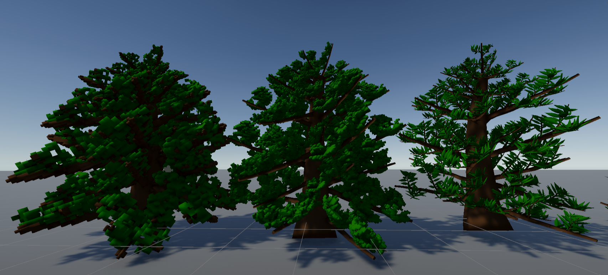
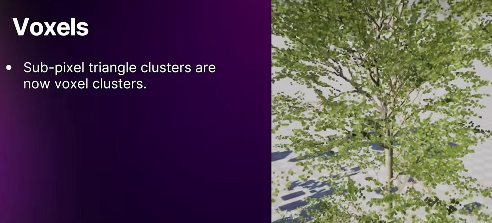

# Unity Foliage Assembly And Voxel-Based Rendering



## Quick Navigation

- [Summary](#summary)
- [Start Here](#start-here)
- [Install](#install)
- [Feature Highlights](#feature-highlights)
- [Common Use Cases](#common-use-cases)
- [Important Limitations](#important-limitations)
- Reference: [What is Foliage Assembly and voxel-based rendering?](#what-is-foliage-assembly-and-voxel-based-rendering)
- [Agentic Workflow](#agentic-workflow)
- [Repo Requirements](#repo-requirements)
- [Verification](#verification)
- Cross-links: [Package README](Packages/com.voxgeofol.vegetation/README.md), [Architecture Authority](DetailedDocs/UnityAssembledVegetation_FULL.md), [Current Milestone](DetailedDocs/Milestone1.md)
- [License](#license)

## Summary

This repository hosts the authoritative vegetation package, repo-local scenes and docs, and the agentic development workflow around them.

The feature itself is an opaque-only, branch-assembled vegetation workflow for Unity 6 URP with GPU classification, GPU-resident indirect emission, and indirect depth/color submission.

Inspired by Unreal Engine 5.7 foliage innovations (Assemblies, voxelized LOD, and hierarchical wind animation).


## Start Here

1. Authoritative feature contract: [Packages/com.voxgeofol.vegetation/README.md](Packages/com.voxgeofol.vegetation/README.md)
2. Architecture authority: [DetailedDocs/UnityAssembledVegetation_FULL.md](DetailedDocs/UnityAssembledVegetation_FULL.md)
3. Current milestone plan: [DetailedDocs/Milestone1.md](DetailedDocs/Milestone1.md)
4. Embedded package: [Packages/com.voxgeofol.vegetation](Packages/com.voxgeofol.vegetation)
5. Playground scene: [Assets/Scenes/Playground.unity](Assets/Scenes/Playground.unity)
6. Package sample content: [Packages/com.voxgeofol.vegetation/Samples~/Vegetation Demo](Packages/com.voxgeofol.vegetation/Samples~/Vegetation%20Demo)
7. Repo-local sample mirror used by scenes: [Assets/Tree](Assets/Tree)

## Install

The distributable Unity package lives at [Packages/com.voxgeofol.vegetation](Packages/com.voxgeofol.vegetation). If you only need the package in another project, install that package path directly instead of copying repo files by hand.

### Install as Git dependency via Package Manager

1. Open Package Manager in Unity (`Window -> Package Manager`).
2. Click `+` in the top-left corner.
3. Select `Add package from git URL...`.
4. Enter the following URL and click `Add`:

```text
https://github.com/studentutu/VoxGeoFoliage.git?path=/Packages/com.voxgeofol.vegetation
```

> NOTE: If you want to pin the install, append `#branch`, `#tag`, or a commit SHA. Do not assume repo tags map cleanly to `package.json` versions.

### Install by editing `Packages/manifest.json`

1. Close Unity if it is holding the manifest open.
2. Open `Packages/manifest.json`.
3. Add the package entry under `"dependencies"`:

```json
"com.studentutu.vegetation": "https://github.com/studentutu/VoxGeoFoliage.git?path=/Packages/com.voxgeofol.vegetation"
```

4. Reopen the project in Unity and let Package Manager resolve the dependency.

### Install from local disk

If this repository is already checked out next to your Unity project, you can point `manifest.json` to the package folder directly:

```json
"com.studentutu.vegetation": "file:../path-to-cloned-repo/Packages/com.voxgeofol.vegetation"
```

Replace `../path-to-cloned-repo` with the actual relative path from your Unity project's `Packages/manifest.json` file to this repository clone.

## Feature Highlights

1. `VegetationTreeAuthoring -> TreeBlueprintSO -> BranchPlacement[] -> BranchPrototypeSO`
2. One blueprint can mix or reuse branch prototypes.
3. Many authorings can share one blueprint.
4. Runtime batching is driven by draw slots keyed by `mesh + material + material kind`.
5. Runtime is container-scoped, GPU-resident, URP-only, opaque-only, and snapshot-based until refresh.

## Missing features

1. [ ] Wind.
2. [ ] Support non-package only materials and shaders.
3. [ ] Generation of canopy-shell (primary voxelization) based on the [GPUVoxelizer](Packages/com.voxgeofol.vegetation/Runtime/VoxelizerV2/Scripts/GPUVoxelizer.cs) from quad, alpha-masked branch material.

## Common Use Cases

1. Repeated trees built from shared branch modules.
2. Mixed species that share meshes and materials for stronger batching.
3. Grass or flowers authored as clumps or as many small plants depending on culling and placement needs.

Examples:

1. `tree species -> 1 blueprint -> many branch placements -> shared branch prototypes`
2. `grass clump -> 1 authoring -> many blade placements`
3. `individual grass -> many authorings -> 1 blade placement each`

For full setup, draw-slot behavior, tradeoffs, pipeline, and limitations, use the package README above as the source of truth.

## Important Limitations

1. No transparent or alpha-clipped runtime vegetation.
2. URP only.
3. Compute-shader and indirect-draw support are required.
4. No CPU fallback.
5. Registration changes after enable require `RefreshRuntimeRegistration()`.

## What is Foliage Assembly and voxel-based rendering?



See Unreal 5.7 foliage assemblies (Nanite vegetation):
- Witcher 4 presentation [Presentation](https://youtu.be/EdNkm0ezP0o?si=YYlytLYKuexVYUOT) 
- Procedural Vegetation Editor/ Nanite vegetation (Nanite Foliage) [OfficialDocs](https://dev.epicgames.com/documentation/en-us/unreal-engine/nanite-foliage)

Short summary:
- No masked / alpha-tested materials, fully opaque based rendering (fully avoid transparency, as it breaks tile-based rendering on mobiles)
- each foliage consists of trunk + branches + leaves (Branch-based assembly with reusable modules)
- reuse branch modules across single tree to minimize memory footprint of the used meshes
- use canopy shells (voxelized mesh) for each of the level of detail.
- each branch consists of multi-level hierarchy of the canopy shells (includes leaves into a voxelized form), thus evenly preserved hight quality in the near and heavy minimize the level of details of obscured (behind the trunk) branches.
- last level of detail (imposter) is fully opaque based on the minimum requirements
- Nanite opaque rendering if very fast if no shader movement exists, thus wind is animated per branch bone (wind is animation, compute shader based)

### Limitation of Unity

We can't make it one-to-one right now, but we still have options:
- Unity doesn't have Nanite alternative, closest to it is an experimental virtual mesh package [VirtualMeshPackage](https://github.com/Unity-Technologies/com.unity.virtualmesh)
- Unity SRP (URP) does support similar mechanism to the assemblies, which is custom render batch by Indirect draw within a custom feature/render pass.
- Reduced geometry at all levels in SRP (custom lods) needs to be explicit for the manual render batch approach
- to keep SRP-friendly batching and allow variation we can use Unity API Renderer Shader User Value (RSUV) which is a tightly pack `uint` that is manually unpacked in shader for any form of variation for the instances.

## Agentic Workflow

1. Read [AGENTS.md](AGENTS.md) before repo work.
2. For feature work, read [memorybank/techContext.md](memorybank/techContext.md), [memorybank/projectrules.md](memorybank/projectrules.md), and [memorybank/FeatureRouter.md](memorybank/FeatureRouter.md), then follow the routed docs.
3. Ask to `read memory bank` before deep repo work and `update memory bank` when documentation or implementation state changes.
4. Fast compile: `./rebuildSolutionWithRiderMsBuild.sh`
5. Full Unity compile and solution refresh: `./rebuildSolutionFromUnityItself.sh`
6. Run Unity tests: `./runTestsFromRoot.sh`
7. Parse Unity test output: `./runParsetests.sh`
8. If Unity, Rider, or Git Bash are installed elsewhere, update the hardcoded paths in those scripts and in [.vscode/tasks.json](.vscode/tasks.json).

### What to change in order to get full agentic workflow

- CI/Tests/Compilation
  - change versions and path to Unity Editor and Rider in: [rebuildSolutionFromUnityItself](./rebuildSolutionFromUnityItself.sh), [parseTestErrors](./parseTestErrors.sh), [rebuildSolutionWithRiderMsBuild](./rebuildSolutionWithRiderMsBuild.sh), [runTestsBash](./runTestsBash.sh)
  - change solution for quick MSBuild (take solution that is generated by Unity Editor) change solution field 'SOLUTION_UNIX="$PROJECT_PATH/LightECS.sln"' in [rebuildSolutionWithRiderMsBuild](./rebuildSolutionWithRiderMsBuild.sh)
- VScode tasks use system git bash path: "C:\\Program Files\\Git\\bin\\bash.exe" (windows path, properly escaped)

## Repo Requirements

1. Unity Hub with a Unity `6000.3+` editor installation.
2. Git and Git Bash.
3. Rider or another MSBuild-capable setup.
4. VS Code is optional, but repo task wrappers are configured there.

## Verification

1. Fast compile output: `CI/RiderMsBuild.log`
2. Unity compile output: `CI/CompileErrorsAfterUnityRun.txt`
3. Unity test output: `CI/CITestOutput.xml`
4. Unity test log: `CI/UnityLogs.log`

## License

MIT license.

1. Root repository license: [LICENSE](LICENSE)
2. Package license: [Packages/com.voxgeofol.vegetation/LICENSE.md](Packages/com.voxgeofol.vegetation/LICENSE.md)
