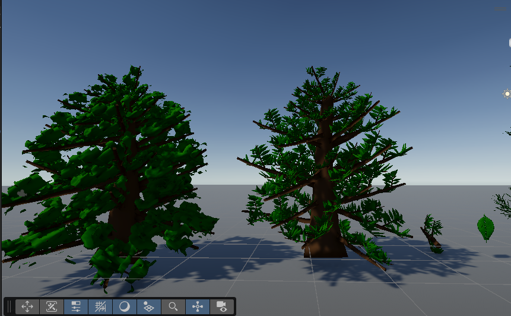

# Unity Foliage Assembly and voxel-based rendering with agentic workflow

Primary purpose is re-integrate into Unity new Unreal 5.7 Foliage assembly workflow (based on nanites and heavy reuse of meshes). 

Inspired by Unreal Engine 5.7 foliage innovations (Assemblies, voxelized LOD, and hierarchical wind animation).

Also includes full agentic workflow outside of Unity Editor.

## What is Foliage Assembly and voxel-based rendering?

See Unreal 5.7 foliage assemblies:
- Witcher 4 presentation (https://youtu.be/EdNkm0ezP0o?si=YYlytLYKuexVYUOT) 
- nanite vegetation https://dev.epicgames.com/documentation/en-us/unreal-engine/nanite-foliage 

Short summary:
- No masked / alpha-tested materials, fully opaque based rendering (fully avoid transparency, as it breaks tile-based rendering on mobiles)
- each foliage consists of trunk + branches + leaves (Branch-based assembly with reusable modules)
- reuse branch modules across single tree to minimize memory footprint of the used meshes
- use canopy shells (voxelized mesh) for each of the level of detail.
- each branch consists of multi-level hierarchy of the canopy shells (includes leaves into a voxelized form), thus evenly preserved hight quality in the near and heavy minimize the level of details of obscured (behind the trunk) branches.
- last level of detail (imposter) is fully opaque based on the minimum requirements
- nanite opaque rendering if very fast if no shader movement exists, thus wind is animated per branch bone (wind is animation, compute shader based)

## Limitation of Unity

We can't make it one-to-one right now:
- Unity doesn't have Nanite alternative (closest to it is an obsolete virtual mesh package https://github.com/Unity-Technologies/com.unity.virtualmesh )
- Unity SRP (URP) does support similar mechanism to the assemblies, which is custom render batch
- Reduced geometry at all levels SRP lods needs to be explicit for the manual render batch approach
- to keep SRP-friendly batching we can use Unity API Renderer Shader User Value (RSUV) which is a tightly pack `uint` that is manually unpacked in shader for any form of variation for the instances.

## Details

1. See proposed plan [UnityVegetationAssemblyPlan](DetailedDocs/UnityAssembledVegetation_FULL.md)
2. See scripts [Scripts](Assets/Scripts/Features/Vegetation)
3. See playground scene [Playground.unity](Assets/Scenes/Playground.unity)

Includes:
- sample mesh very hight poly pine tree, see [ChristmasTree](Assets/Tree/Raw/ChristmasTree.fbx) with separate trunk and branches mesh from the leaves mesh (pines)
- sample high poly single Fern leaf, see [fern_foliage_dense](Assets/Tree/Raw/fern_foliage_dense_fullgeo.obj)
- sample branch for standard tree, see [branch_leaves](Assets/Tree/Raw/branch_leaves_fullgeo.obj)
- demo terrain with mass-placement, see scene [BigPineForest.unity](Assets/Scenes/PineForest/BigPineForest.unity)

## Prerequisites

### Required

- Unity Hub with unity Editor
- git + git bash
- Rider ( or MSBuild required, version 14+ )

### Optional

- Agentic CLI/VSCode Extension
- VSCode  (make sure to set terminal to bash per extension settings)

## Agentic workflow

- Milestones
  - ask to generate but first provide specific a full Game Design document
- Memory bank
  - ask to read memory bank
  - ask to update memory bank
  - no default progress, ask to create and maintain (preferable per milestone/feature).
- Tests + compilation without Unity (using MSBuild with provided unity generated solution)
  - ask run unity tests
  - ask parse unity tests
  - ask fast-recompile project

## What to change

- CI/Tests/Compilation
  - change versions and path to Unity Editor and Rider in: [rebuildSolutionFromUnityItself](./rebuildSolutionFromUnityItself.sh), [parseTestErrors](./parseTestErrors.sh), [rebuildSolutionWithRiderMsBuild](./rebuildSolutionWithRiderMsBuild.sh), [runTestsBash](./runTestsBash.sh)
  - change solution for quick MSBuild (take solution that is generated by Unity Editor) change solution field 'SOLUTION_UNIX="$PROJECT_PATH/LightECS.sln"' in [rebuildSolutionWithRiderMsBuild](./rebuildSolutionWithRiderMsBuild.sh)
- VScode tasks use system git bash path: "C:\\Program Files\\Git\\bin\\bash.exe" (windows path, properly escaped)
- Custom Simulation/ViewLoop
  - SimulationSystemGroup for simulation
  - ViewSystemGroup for view-presentation

## Verification

- Tests, Compilation, Editor Runtime
  - verified
- Build (Mono, IL2Cpp)
  - verified